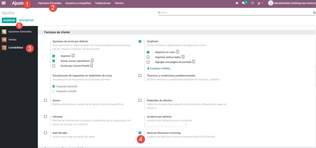
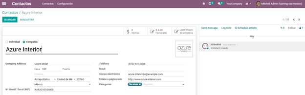

======
Mexico
======

Webinars
========

Below you can find videos with a general description of the localization, and how to configure it.

- `VIDEO WEBINAR OF A COMPLETE DEMO <https://youtu.be/JSqQo5eRqlI>`_.

Introduction
============

Odoo Enterprise users in Mexico have free access to a set of modules that allow them to issue
electronic invoices according to the specifications of the SAT for `version 3.3 of the CFDI
<http://omawww.sat.gob.mx/informacion_fiscal/factura_electronica/Documents/GuiaAnexo20Global.pdf>`_,
a legal requirement as of January 1, 2018. These modules also add relevant accounting reports (for
example, the DIOT), and enable foreign trade, with support for associated customs operations.

With the Mexican location in Odoo you will not only be able to comply with the legal requirements to
invoice in Mexico, but also use it as your accounting system, satisfying the normal needs of the
market. This makes Odoo the perfect solution to manage your business in Mexico.

Pre requirements
================

Before installing the modules and making the necessary configurations to have the Mexican
localization in Odoo, it is necessary to meet the following requirements:

#. Be registered with the SAT and have an RFC.
#. Have a `Certificate of Digital Seal
   <https://www.gob.mx/sat/acciones-y-programas/certificado-de-sello-digital>`_ (CSD).
#. Choose a PAC and purchase stamps. Currently the Mexican location in Odoo works with two PACs:
   `Feasible Solution <https://solucionfactible.com/>`_, `Quadrum (formerly Finkok)
   <https://cfdiquadrum.com.mx/index.html>`_ and `SW Sapien - Smarter Web <https://sw.com.mx/>`_.
#. Have knowledge and experience with billing, sales and accounting in Odoo. This documentation
   contains only the information necessary to enable the use of Odoo in a company based in Mexico.
   For information on how to use these applications, see the page :doc:`../../../index`.

Modules
=======

To install the Mexican localization module, go to :menuselection:`Apps`, then remove the default
filter "Apps" and search for ``l10n_mx``.

.. image:: media/mx_mo_01.png
   :align: center
   :alt: Installation of the Mexican localization module in Odoo Apps

.. note::
   If you created the database from `www.odoo.com <https://www.odoo.com>`_ and chose "Mexico" as the
   country when creating your account, some of the Mexican localization modules will have been
   installed automatically. In that case we observe that some modules have a button that says
   "Install", while others will instead have a label that says "Installed".

The following modules are necessary for all databases that require Mexican localization:

#. | **Mexico - Accounting (l10n_mx)**
   | All the basic data to manage accounting, taxes and the chart of accounts. The installed chart
     of accounts is based on `the SAT account grouping code
     <https://www.gob.mx/cms/uploads/attachment/file/151586/codigo_agrupador.pdf>`_.
#. | **EDI for Mexico (l10n_mx_edi)**
   | Necessary for electronic transactions, CFDI 3.3, payment complement, and addenda on invoices.
#. | **Odoo Mexican localization reports (l10n_mx_reports)**
   | All mandatory reports for electronic accounting. (Requires the accounting application).

The following modules are optional, and should be installed only if they meet a specific
organization requirement. Installing these modules is not recommended unless you are sure they
are needed as they add fields that can unnecessarily complicate form filling.

#. | **EDI External Trade Complement for Mexico (l10n_mx_edi_external_trade)**
   | For clients that export, add the foreign trade complement to the CFDI, and the logic for
     filling it.
#. | **Odoo Mexico Localization for Invoice with customs Number (l10n_mx_edi_customs)**
   | For importing customers, this module allows adding to the CFDI the request number with which
     the merchandise to be resold entered. When it is imported into Mexico, in the invoice that
     comes from any foreign country it is necessary to specify which was the import document; This
     is known as a "pedimento", and it is processed at customs.
#. | **Odoo Mexico Localization for Stock / Landing (l10n_mx_edi_landing)**
   | Related to the import module (*l10n_mx_edi_customs*), this module allows managing the requests
     as part of the shipping costs.
#. | **Bank account payment to Mexico (l10n_mx_edi_payment_bank)**
   | Add optional attributes to the payment plugin, allowing the user to select the bank account
     that was used to pay the bills.
#. | **Odoo Mexico Localization for Sale Coupon (l10n_mx_edi_sale_coupon)**
   | Complements the Odoo coupon module (*sale_coupon*) to avoid errors in the generation of CFDIs.
#. | **Tax Cash Basis Entries at Payment Date (l10n_mx_tax_cash_basis)** Create journal entries for
   | taxes on the payment date (instead of the issue date).

Configuration
=============

Enable electronic invoicing
---------------------------

Go to :menuselection:`Settings --> Accounting --> Customer Invoices`, and make sure that the option
**Mexican Electronic Invoicing** is enabled. With this you will be able to generate the signed 
invoice and also generate the signed payment complement, all automatically integrated into the 
normal billing flow in Odoo.

Enter legal information
-----------------------

After verifying the general configuration, you must verify that the company is configured with the
correct data. To do so, go to :menuselection:`Settings --> General Settings --> Companies`, and
click on *Update information* under your company name.

.. image:: media/mx_co_02.png
   :align: center
   :alt: Update the company's details in the Settings of Odoo

In the resulting form, put your full address (including zip code), RFC (VAT number), and the rest of 
the data.

.. warning::
   Make sure that in the address, for the Country field, "Mexico" is chosen from the list of
   countries that Odoo shows, because if it is entered manually there is a risk of creating a "new
   country" in the system, which it will result in errors later when the CFDIs are generated.

   .. image:: media/mx_co_03.png
      :align: center
	  :alt: Company data information

.. tip::
   If you want to test the Mexican localization, you can configure the company with a real address
   within Mexico (including all fields) and add ``EKU9003173C9`` as RFC.

Set the fiscal regime of the company
------------------------------------

The following is to indicate what is the fiscal regime of the company that we are configuring, which is
done through a pre-existing field in Odoo called "Fiscal Regime".

Go to :menuselection:`Settings --> Accounting --> Electronic invoicing (MX) --> Fiscal Regime`, and 
select the option that applies to your company from the drop-down list.

.. image:: media/mx_co_04.png
   :align: center
   :alt: Set the Fiscal Regime in Odoo Accounting

.. tip::
   For the test environment: Select the option **General Law on Legal Persons** from the drop-down
   menu.

Contacts Configuration
----------------------

When creating a contact to be invoiced in Odoo, the following information must be configured for
invoice validation: **complete address** (including postal code, external number, country, etc.) and
the **VAT** number.

Taxes Configuration
-------------------

A necessary configuration for electronic invoicing to work correctly in Odoo is to add the type of
factor associated with sales taxes.

To make the configuration you first have to go to the application **Accounting**, then click on the
menu **Configuration** and select the option **Tax**.

Within the list of taxes that are pre-loaded, select the option in filters **Offer**, this to see
only taxes associated with the sale, which are those that are validated for the stamping of
invoices. Open the form view of any of the sales taxes, select the tab **Advanced options** and
within the field **Factor Type** choose the option **Rate**.

.. image:: media/mx_co_06.png
   :align: center
   :alt: Taxes configuration

Products Configuration
----------------------

.. image :: images / mx_co_08.png
     : align: center
     :alt: Configure products

Configure the PAC to sign invoices
----------------------------------

.. image :: images / mx_co_09.png
     : align: center
     :alt: PAC credentials
	 
.. image :: images / mx_co_10.png
     : align: center
     :alt: Certificate and key

Workflows
=========

Electronic invoicing
--------------------

.. image :: images / mx_ft_01.png
     : align: center
     :alt: Creating an invoice

Invoicing Special Cases
-----------------------

Foreign Trade Invoice
~~~~~~~~~~~~~~~~~~~~~

Assign the request
~~~~~~~~~~~~~~~~~~

Payment Terms
~~~~~~~~~~~~~

PPD Payments
************

PUE
***

Payments
--------

Register PPD Payments
~~~~~~~~~~~~~~~~~~~~~

Register PUE Payments
~~~~~~~~~~~~~~~~~~~~~

Payment Advances
~~~~~~~~~~~~~~~~

Process to create advance in Mexico
***********************************

Steps to follow in Odoo
***********************

Preparation: Create
^^^^^^^^^^^^^^^^^^^

Issuance of the electronic invoice for the value of the advance received
^^^^^^^^^^^^^^^^^^^^^^^^^^^^^^^^^^^^^^^^^^^^^^^^^^^^^^^^^^^^^^^^^^^^^^^^

Issuance of the electronic invoice for the total value of the operation.
^^^^^^^^^^^^^^^^^^^^^^^^^^^^^^^^^^^^^^^^^^^^^^^^^^^^^^^^^^^^^^^^^^^^^^^^

Add credit note from invoice
^^^^^^^^^^^^^^^^^^^^^^^^^^^^

Discounts
~~~~~~~~~

Create and assign the corresponding Payment Term
************************************************

Register the Payment within the days of the discount
****************************************************

Create a credit note
********************

Cancellation of invoices
------------------------

Before 72 Hours
~~~~~~~~~~~~~~~

After 72 Hours
~~~~~~~~~~~~~~

Cancel Paid Invoices
~~~~~~~~~~~~~~~~~~~~

Cancel Invoices from the previous period
~~~~~~~~~~~~~~~~~~~~~~~~~~~~~~~~~~~~~~~~

Problem
*******

Solution
********

Close accounting period each month (Best Practice Mexican Localization)
^^^^^^^^^^^^^^^^^^^^^^^^^^^^^^^^^^^^^^^^^^^^^^^^^^^^^^^^^^^^^^^^^^^^^^^

Cancel invoice in the SAT
^^^^^^^^^^^^^^^^^^^^^^^^^

Create Manual Reversal voucher
^^^^^^^^^^^^^^^^^^^^^^^^^^^^^^

Reconcile the open invoice with the reversal entry
^^^^^^^^^^^^^^^^^^^^^^^^^^^^^^^^^^^^^^^^^^^^^^^^^^

Change status of Electronic Invoicing Canceled with server
^^^^^^^^^^^^^^^^^^^^^^^^^^^^^^^^^^^^^^^^^^^^^^^^^^^^^^^^^^

Electronic Accounting
---------------------

Electronic Accounting Plan (Called and displayed as COA).
~~~~~~~~~~~~~~~~~~~~~~~~~~~~~~~~~~~~~~~~~~~~~~~~~~~~~~~~~

How to add new accounts?
************************

What is the meaning of the category?
************************************

Electronic Verification Balance
~~~~~~~~~~~~~~~~~~~~~~~~~~~~~~~

DIOT Report (requires accounting application)
~~~~~~~~~~~~~~~~~~~~~~~~~~~~~~~~~~~~~~~~~~~~~

What is DIOT and the importance of presenting it SAT
****************************************************

When to present the DIOT and in what format?
********************************************

Where is DIOT presented?
************************

One more thing to know: batch loading?
**************************************

How to generate this report in Odoo?
************************************

Important considerations about your supplier and invoice data for DIOT
**********************************************************************

Closure Annual Accounting In Odoo
---------------------------------

Year-end
~~~~~~~~

Accounting Closing Process
~~~~~~~~~~~~~~~~~~~~~~~~~~

Additional featuresRecommended
==============================

ContactsModule (Free)
---------------------

Multi currency (Requires Accounting application)
------------------------------------------------

Common problems and errors
==========================

Glossary
========
